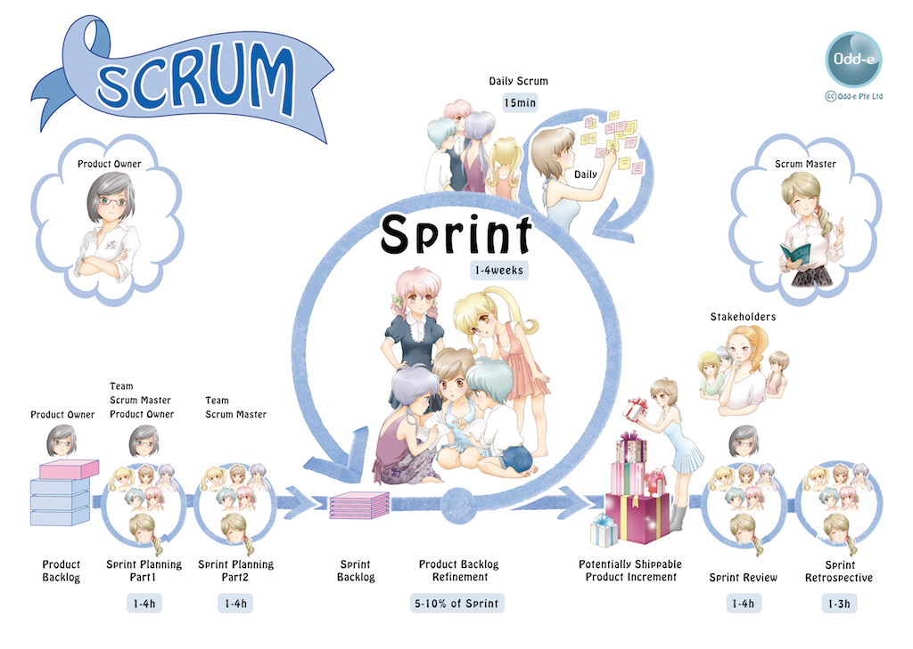
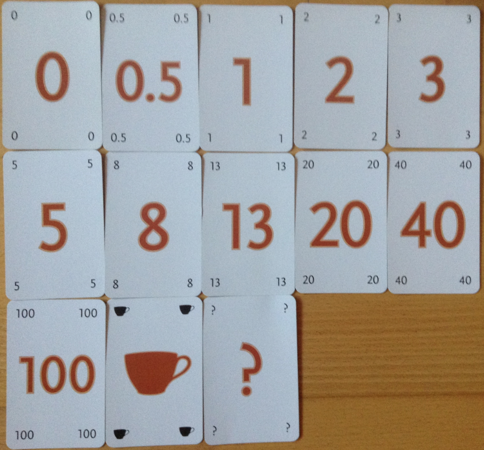

# 敏捷軟體開發

> 敏捷軟體開發（英語：Agile software development），又稱敏捷開發，是一種從1990年代開始逐漸引起廣泛關注的一些新型軟體開發方法，是一種應對快速變化的需求的一種軟體開發能力。它們的具體名稱、理念、過程、術語都不盡相同，相對於「非敏捷」，更強調程式設計師團隊與業務專家之間的緊密協作、面對面的溝通（認為比書面的文檔更有效）、頻繁交付新的軟體版本、緊湊而自我組織型的團隊、能夠很好地適應需求變化的代碼編寫和團隊組織方法，也更注重軟體開發過程中人的作用。（出自於維基百科）

## 價值觀

* 個人與互動：重於 流程與工具
* 可用的軟體：重於 詳盡的文件
* 與客戶合作：重於 合約協商
* 回應變化：重於 遵循計劃

## 敏捷宣言

* 我們最優先的任務，是透過及早並持續地交付有價值的軟體來滿足客戶需求。
* 竭誠歡迎改變需求，甚至已處開發後期亦然。敏捷流程掌控變更，以維護客戶的競爭優勢。
* 經常交付可用的軟體，頻率可以從數週到數個月，以較短時間間隔為佳。
* 業務人員與開發者必須在專案全程中天天一起工作。
* 以積極的個人來建構專案，給予他們所需的環境與支援，並信任他們可以完成工作。
* 面對面的溝通是傳遞資訊給開發團隊及團隊成員之間效率最高且效果最佳的方法。
* 可用的軟體是最主要的進度量測方法。
* 敏捷程序提倡可持續的開發。贊助者、開發者及使用者應當能不斷地維持穩定的步調。
* 持續追求優越的技術與優良的設計，以強化敏捷性。
* 精簡──或最大化未完成工作量之技藝──是不可或缺的。
* 最佳的架構、需求與設計皆來自於能自我組織的團隊。
* 團隊定期自省如何更有效率，並據之適當地調整與修正自己的行為。

## Scrum 專案管理方法

Scrum 的角色與分工。

Scrum 強調每個階段都有「最小可行性」的產出

Scrum 任務牆。

Scrum 估算時數的方法。

