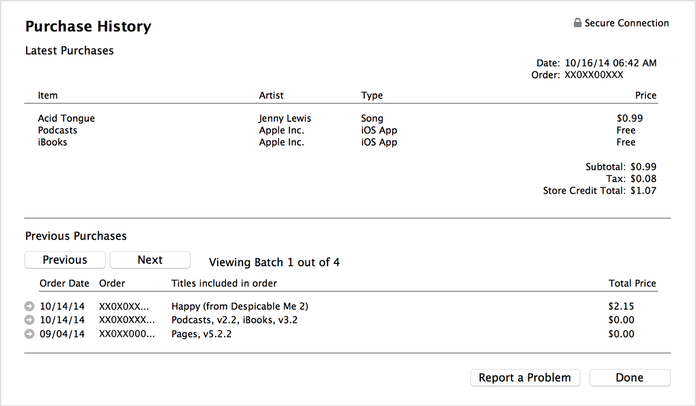

# 概念模型

概念模型（Conceptual Models）用來表達領域中涉及的各種類別。

## 擷取概念

表單及領域知識

* 需求分析文件
* 使用案例
* 企業表單報表
* 類似系統 

分類表

* 人事時地物
* 交易內容
* 牽涉的相干事物

## 練習一、網路開店

[使用 Hackpad 完成練習](https://hackpad.com/we6UdUKheF2)

## 練習二、經營農場

[使用 Hackpad 完成練習](https://hackpad.com/4d7MRTtIZwZ)

<!--
* [新聞連結一](https://tw.news.yahoo.com/%E9%9B%B2%E6%9E%97%E6%96%97%E5%85%AD%E9%9B%B2%E7%AB%AF%E6%9F%B3%E4%B8%81%E4%B8%8A%E5%B8%82%E9%9B%B2%E7%A7%91%E5%A4%A7%E5%8D%94%E5%8A%A9%E8%A1%8C%E9%8A%B7-081027126.html)
* [新聞連結二](http://udn.com/NEWS/DOMESTIC/DOM5/9093791.shtml)
-->