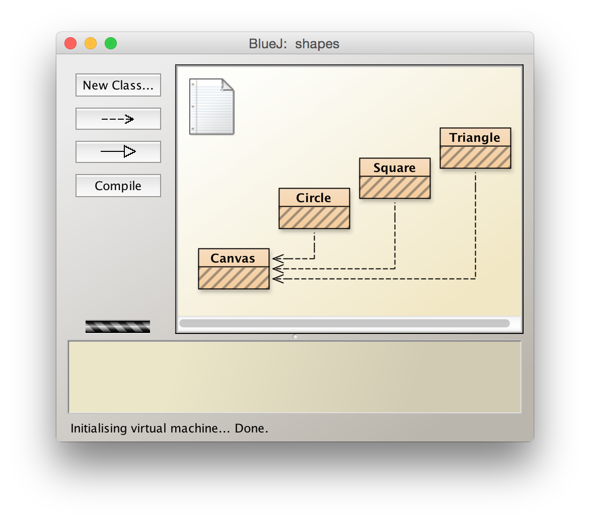

# BlueJ

BlueJ 是一套免費的 Java IDE 工具，它專為 Java 語言新手設計，提供視覺化的操作方式。

> "One of my favourite IDEs out there is BlueJ"
> 
> — James Gosling, creator of Java.

http://www.bluej.org/

Windows 版本

* 自動安裝程式 [BlueJ + JDK Installer](http://www.bluej.org/download/files/bluej-bundled-314.msi)

如果無法自動安裝，可以從「Other Operating Systems」下載「BlueJ Installer」替代安裝方式。

BlueJ Installer - [bluej-314.jar](http://www.bluej.org/download/files/bluej-314.jar)

點擊 .jar 檔案執行，安裝過程必須選擇正確的 jdk 安裝路徑。