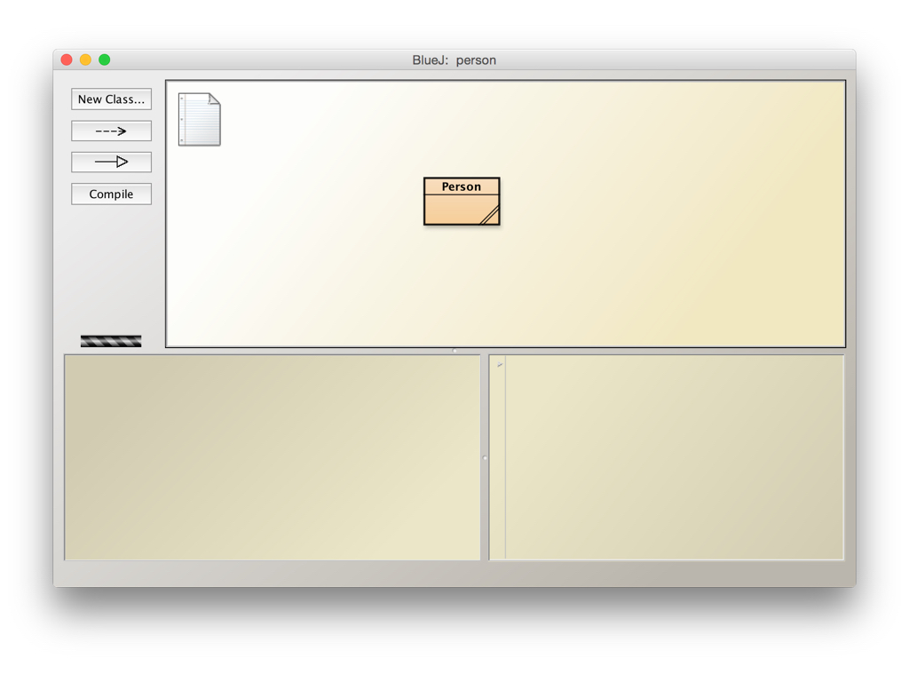
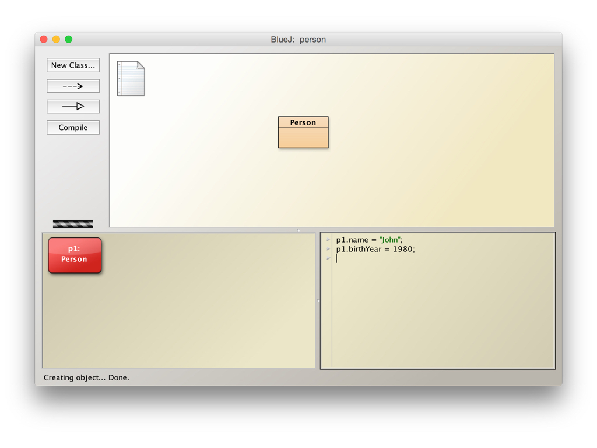
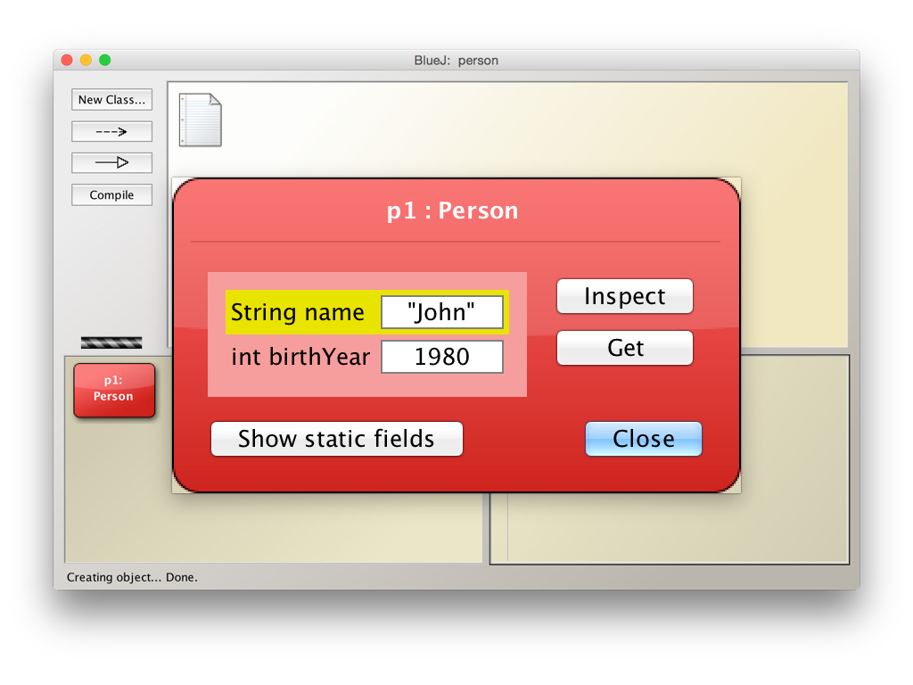
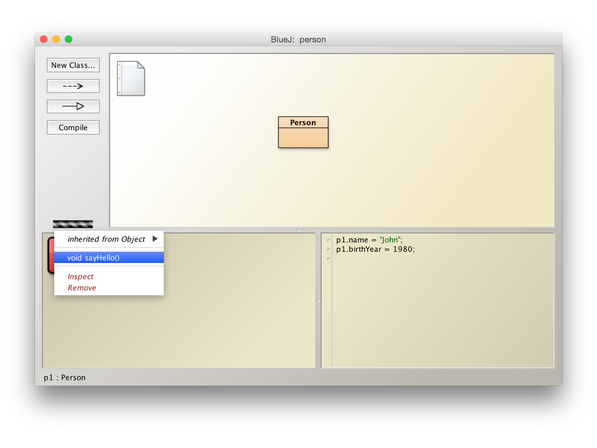
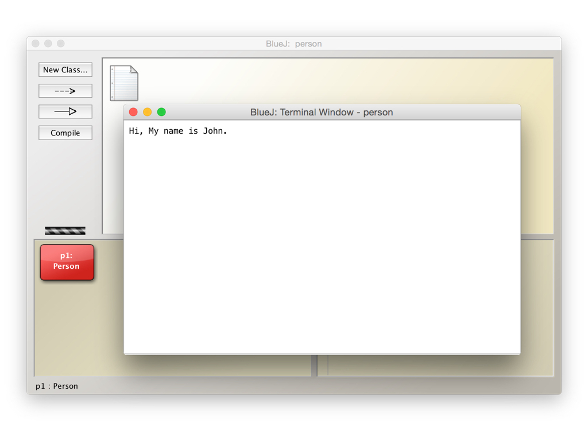

# 互動式編程

選單「View > Show Code Pad」打開 Code Pad。



「Person」類別的程式碼範例：

```java
class Person {
    String name;
    int birthYear;
    
    void sayHello() {
        System.out.println("Hi, My name is " + name + ".");
    }
}
```









