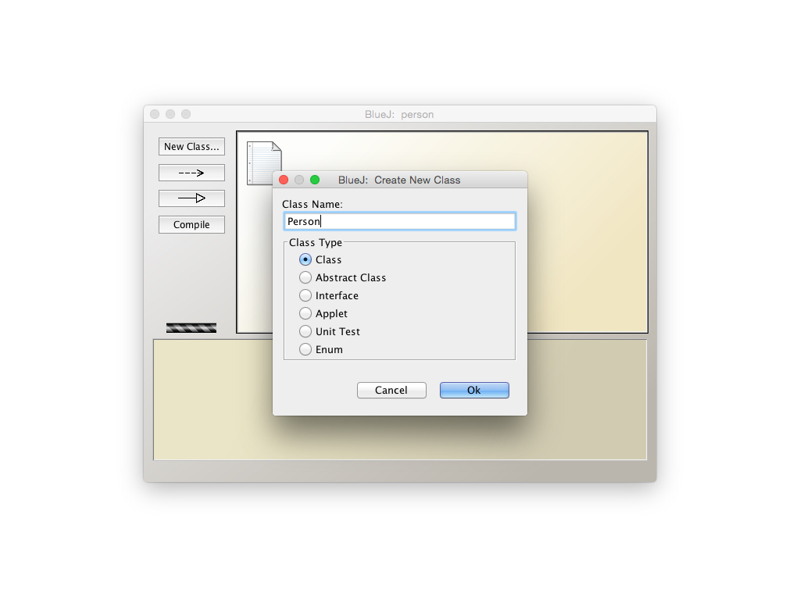
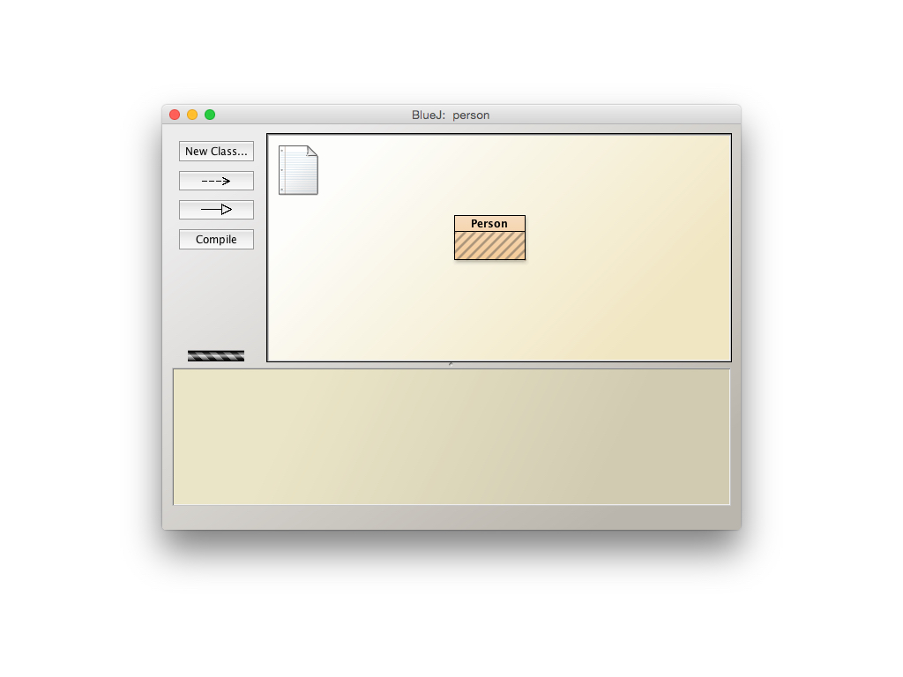
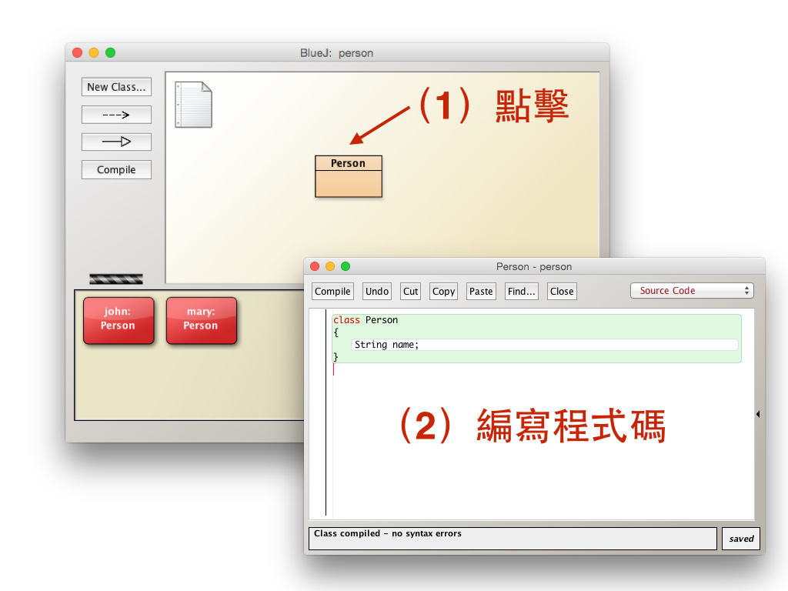
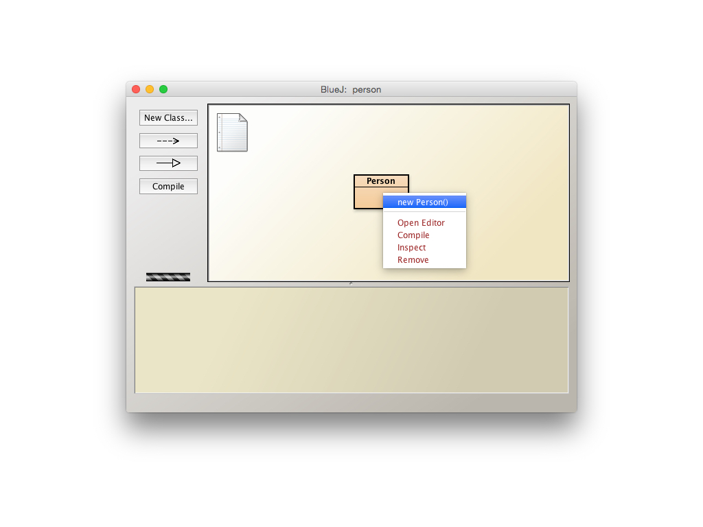
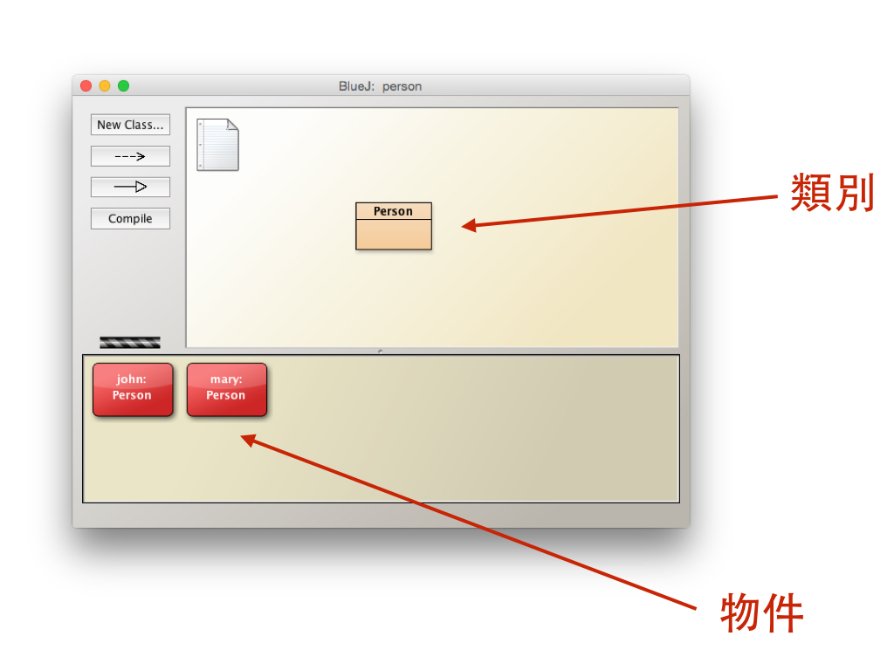

# 操作說明

第一次使用 BlueJ 嗎？不用擔心，它真的很簡單，跟著以下步驟完成第一個練習吧！

BlueJ 的主畫面。


點擊左邊的「New Class」 ，產生一個新的類別「Person」。



新類別 Person 已經建立，可以用滑鼠拖曳位置。



點兩下打開 Person 類別的程式碼編輯器，輸入以下程式碼。

```java
class Person {
    String name;
}
```



在類別按滑鼠右鍵，選擇「new Person()」建立一個新物件。



為新的 Person 物件輸入一個名字（name）。


大功告成！BlueJ 畫面的上方為類別編輯區，下方則是物件顯示的地方。


