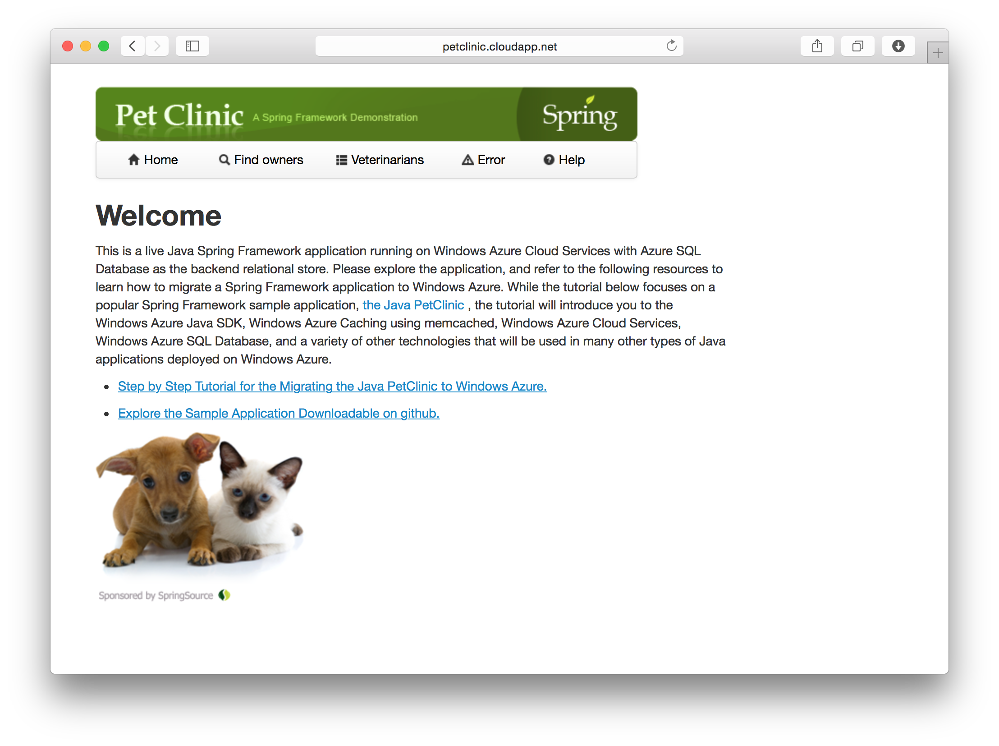

# 需求分析

Pet Clinic Application 是寵物醫院看診預約管理系統，由一家 Spring 公司提供，它是一個示範 Spring Framework （Java 的開發框架）實際應用的小型範例。

在這個單元，我們將從實際的範例瞭解一個系統的建構。

Pet Clinic 在 GitHub 提供完整程式碼：

* [Spring PetClinic Sample Application](https://github.com/spring-projects/spring-petclinic/)

## Use Cases

* View a list of veterinarians and their specialties
* View information pertaining to a pet owner
* Update the information pertaining to a pet owner
* Add a new pet owner to the system
* View information pertaining to a pet
* Update the information pertaining to a pet
* Add a new pet to the system
* View information pertaining to a pet's visitation history
* Add information pertaining to a visit to the pet's visitation history

## Business Rules

An owner may not have multiple pets with the same case-insensitive name.

## Web Site Demo

請瀏覽已上線的 Pet Clinic 網站，操作它的各項功能以瞭解寵物診所預約流程。

http://petclinic.cloudapp.net/

