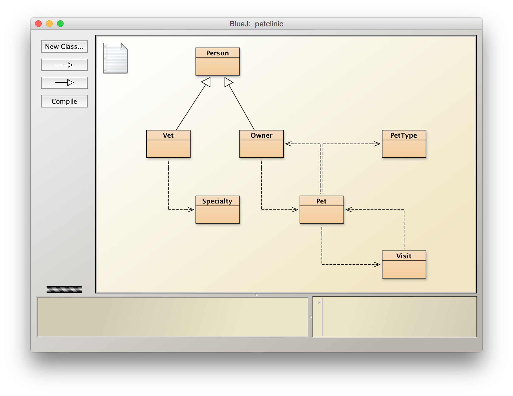

# Source Code



Person

```java
class Person {
    String firstName;
    String lastName;
}
```

Vet

```java
import java.util.Set;

class Vet extends Person {
    Set<Specialty> specialties;
}
```

Owner

```java
import java.util.Set;

class Owner extends Person {
    String address;
    String city;
    String telephone;
    Set<Pet> pets;    
}
```

PetType

```java
class PetType {
    String name;
}
```

Specialty

```java
class Specialty {
    String name;
}
```

Pet

```java
import java.util.Date;
import java.util.Set;

class Pet {
    String name;
    Date birthDate;
    PetType type;
    Owner owner;
    Set<Visit> visits;
}
```

Visit

```java
import java.util.Date;

class Visit {
    Date date;
    String description;
    Pet pet;
}
```