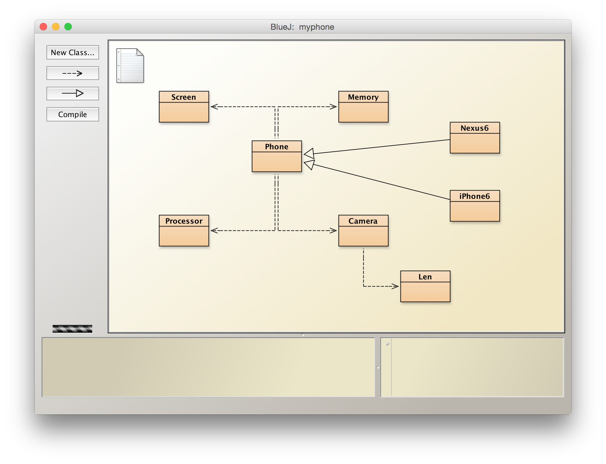

# 繼承（inheritance）

利用物件導向的繼承，實作不同款式的手機類別。

```uml
@startuml
Phone <|-- iPhone6
Phone <|-- iPhone6Plus
Phone <|-- Nexus6
@enduml
```

## 作業練習

一、根據不同款手機的規格參數，利用物件的建構子（constructor）初始化手機的各項屬性。



參考程式碼：

```java
class Nexus6 extends Phone {
    Nexus6() {
        screen = new Screen();
        screen.inch = 5.96;
        screen.width = 2560;
        screen.height = 1440;
        
        processor = new Processor();
        processor.core = 4;
        processor.speed = 2.7;
        
        // ...請完成其餘程式碼...
    }
}
```