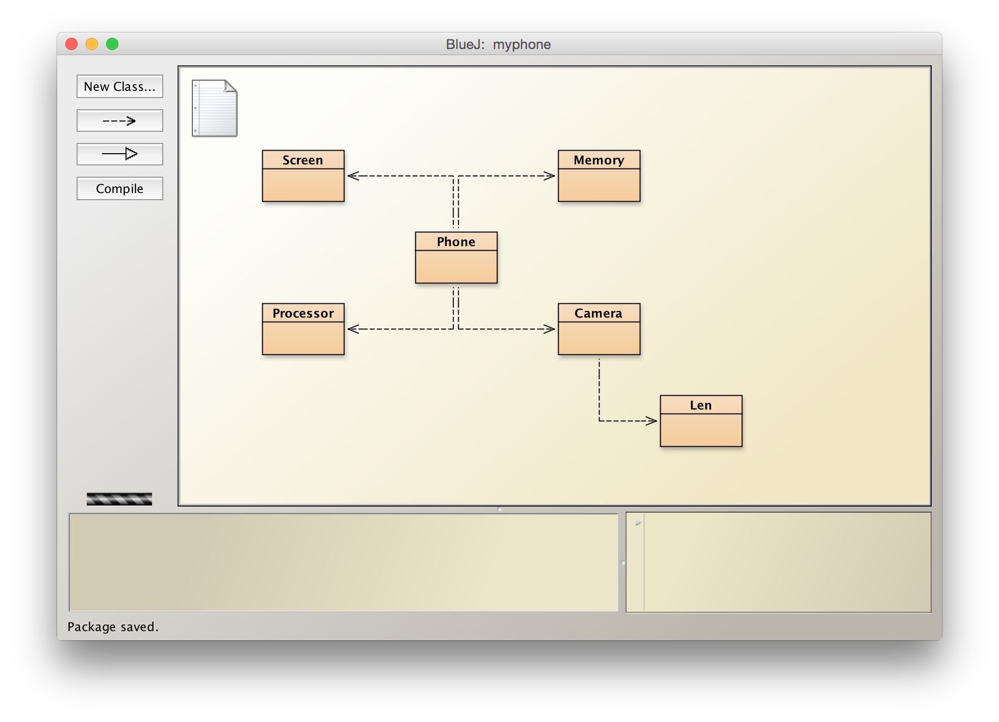

# 程式碼（Source Code）




## Phone

```java
class Phone {
    String name;
    int price;
    
    Screen screen;
    Processor processor;
    Memory memory;
    Camera camera;
}
```

## Screen

```java
class Screen {
    double inch;
    int width;
    int height;
}
```

## Memory

```java
class Memory {
    int size;
}
```

## Processor

```java
class Processor {
    int core;
    double speed;
}
```

## Camera

```java
class Camera {
    Len len;
}
```

## Len

```java
class Len {
    int pixel;
}
```


