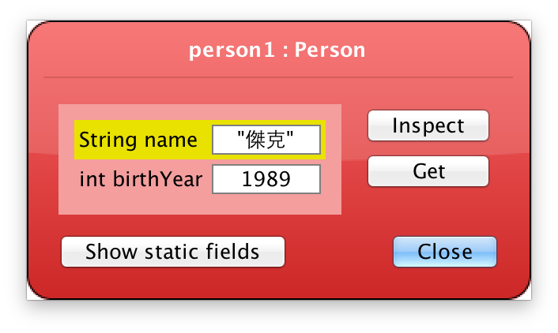

# 建構子

定義在建立物件時程式需要執行的工作，可以用來接收參數。

```java
class Person {
    String name;
    int birthYear;

    //建構子    
    Person(String name, int birthYear) {
        this.name = name;
        this.birthYear = birthYear;
    }
}
```

利用建構子的參數，在建立 Person 物件時，設定姓名與出生年份。



