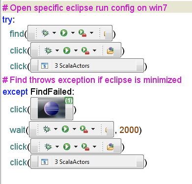

# 自動化測試入門

自動化測試是提昇軟體品質重要的流程，一個良好的軟體專案，程式碼不但需要「可以測試」，而且也必讓測試「自動化」進行。

## 自動化測試的時機

* 每次修改程式碼後
* 每日或每週
* 每次的版本發行
* 系統正式上線前後

## 軟體測試的類型

* 單元測試（Unit Test）
* 整合測試（Integration Test）
* 壓力測試（Load Test）
* 驗收測試（UAT）

## 使用 Sikuli Script

http://www.sikuli.org/

## 線上瀏覽器測試工具

這些工具提供不同版本的瀏覽器，可以針對指定的網站與任務進行測試，並且可以在遠端執行。

* https://www.browserstack.com/
* https://saucelabs.com/
* https://crossbrowsertesting.com/

## 使用 CrossBrowserTesting

https://crossbrowsertesting.com/
