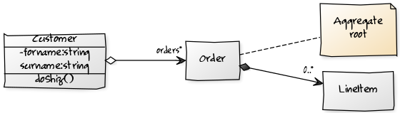

# yUML

Create and share simple UML diagrams in your 
blogs, wikis, forums, bug-trackers and emails.

http://yuml.me/

原始碼

```
// Cool Class Diagram
[Customer|-forname:string;surname:string|doShiz()]<>-orders*>[Order]
[Order]++-0..*>[LineItem]
[Order]-[note:Aggregate root{bg:wheat}]
```

轉換成 UML 的圖片

